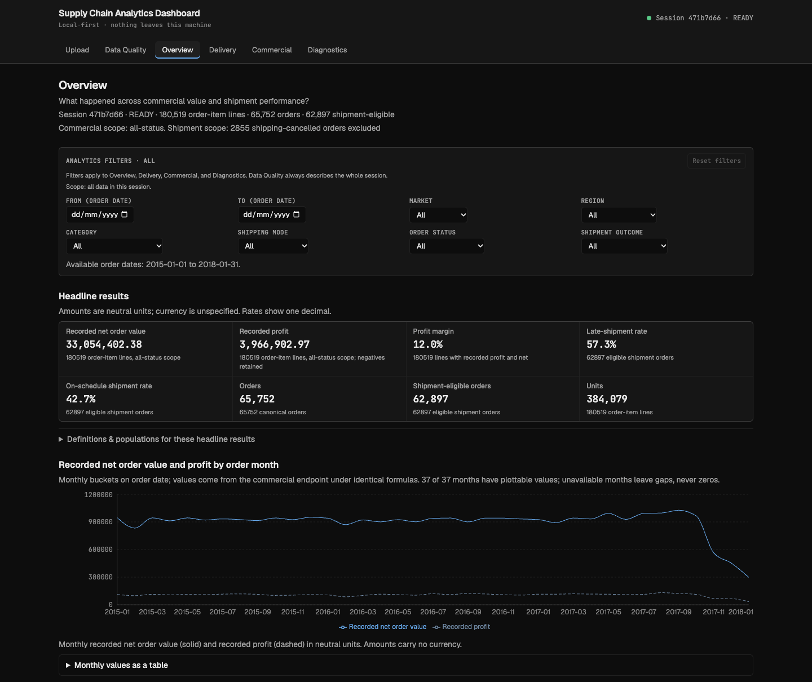
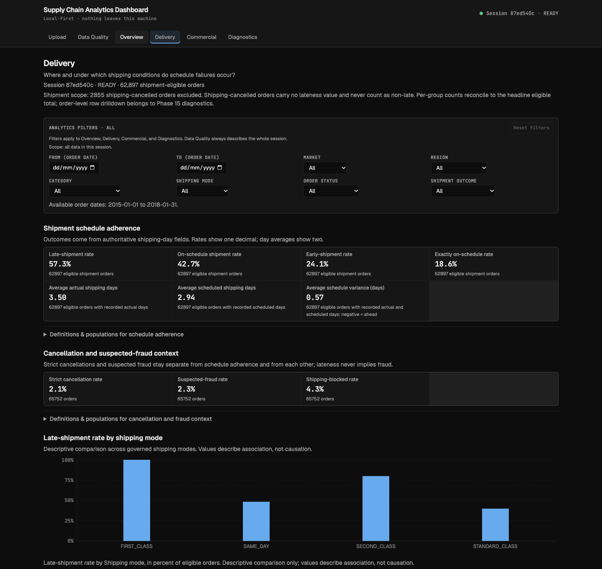
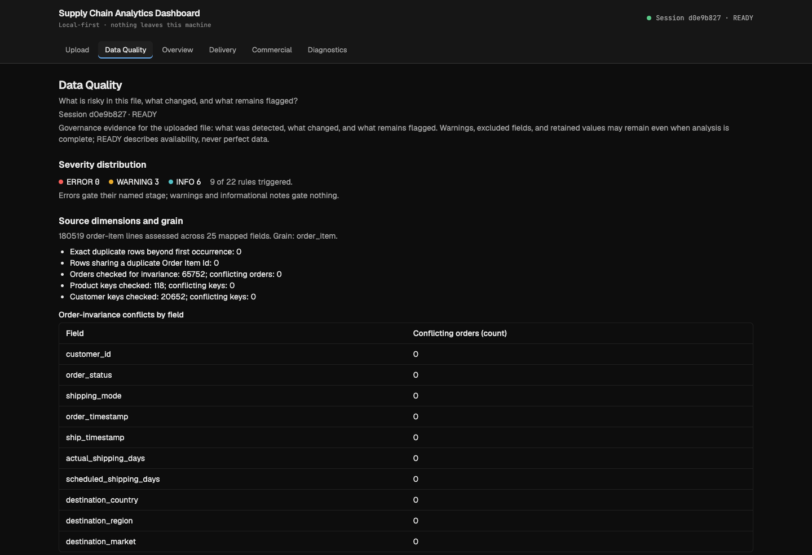

# Supply Chain Analytics Dashboard

Supply Chain Analytics Dashboard is a local-first analytics application that turns DataCo-compatible supply-chain CSV data into an auditable data-quality report and an interactive operational-performance dashboard.

Local-first portfolio project · Python 3.12 / FastAPI / pandas · React / TypeScript / shadcn/ui / Recharts · V1 core engineering complete

## Why this project

Operational CSV exports are rarely analysis-ready. A single supply-chain file can mix two different grains (individual order lines vs. whole orders), use inconsistent labels, contain invalid or missing values, carry privacy-sensitive columns that should never reach a dashboard, and use ambiguous delivery terminology where "late" is never precisely defined. Analyzing such a file at face value produces incorrect shipment-performance rates, double-counted orders, misleading commercial totals, and cleaning decisions nobody can trace.

This project exists to show those problems handled rigorously: every upload is profiled, validated, and cleaned through governed rules with a full audit trail, order and order-line grains are kept separate, every metric is explicitly defined before it is charted, and the dashboard always shows the evidence behind its numbers.

## What it does

Upload a DataCo-compatible CSV in the browser. The application validates the file, profiles it without modifying it, applies only documented reversible cleaning while logging every outcome, separates the data into a canonical model (orders, order lines, products, sanitized customers, calendar, quality findings), computes backend-owned KPIs at the correct grain, and presents the results across six views: Upload, Data Quality, Executive Overview, Delivery, Commercial, and Diagnostics — with filtered drilldown to individual orders and sanitized exports of approved outputs.

Raw uploads are never modified. Cleaning produces a new, auditable representation, and every transformation records what was detected, fixed, flagged, excluded, or left unchanged.

## Try it with the bundled synthetic demo

The fastest way to review the full workflow without downloading the reference file:

```sh
make install          # install frontend (npm ci) + backend (uv sync) dependencies
# Terminal 1: backend
make dev-backend      # FastAPI on http://127.0.0.1:8000
# Terminal 2: frontend
make preview-frontend # builds the production frontend, then starts the Vite preview
```

Open the URL printed by Vite (normally http://localhost:4173), upload `demo/supply-chain-demo.csv`, wait for the session to reach READY, then explore Overview, Delivery, Commercial, Diagnostics, and Data Quality.

The bundled file is synthetic reviewer data: it represents no real company or operations, was constructed for reviewer/demo use, and was generated independently from the governed schema and demo contract — DataCo source records were not used as generation input. It uses unmistakably synthetic (`SYN-`) identifiers and is compatible with the governed application schema. It is intentionally small for quick local review — six synthetic months, all four shipping modes, all three customer segments, profitable and loss-making activity, and non-blocking data-quality findings including categorical normalization, a flagged unknown order status, a flagged extreme negative-profit value, and a flagged gross/discount/net mismatch. The synthetic provenance marker is intentionally unmapped and is quarantined from canonical analytics. Demo values exercise the workflow; they are not benchmarks and support no conclusions about any real operation.

The full-scale V1 reference remains the external DataCo file below — the demo is reviewer convenience for quick exploration, not a replacement for the reference/regression dataset.

## Questions the dashboard can answer

- Which shipping modes are associated with the highest late-shipment rates?
- Where are recorded profit and recorded order value concentrated — by market, region, category, or product?
- Which markets, regions, or categories warrant deeper investigation into shipment adherence or loss-making orders?
- How much of the uploaded data was fixed, flagged, excluded, or left unchanged during cleaning?
- Which individual orders sit behind an aggregate pattern, and what do their shipment and commercial facts look like?

Findings are associational and descriptive: diagnostics surface patterns for investigation, never causal claims.

## Dashboard views

- **Executive Overview** — headline operational and commercial measures: recorded order value, recorded profit, margin, shipment-outcome rates, order and unit counts, plus trend and market/region context.

  

  *Executive Overview over the full unfiltered DataCo reference file: headline results and the monthly recorded-value trend.*
- **Delivery** — shipment adherence (late / early / exactly-on-schedule outcomes), actual vs. scheduled shipping days, and breakdowns by shipping mode, region, market, category, and time, with the eligible population stated.

  

  *Delivery over the full DataCo scope: schedule-adherence outcomes with the per-shipping-mode breakdown.*
- **Commercial** — recorded gross and net order value, discounts, recorded profit, amount-weighted margin and discount rates, units, and loss-making-order analysis across product and geography dimensions.
- **Diagnostics** — shared filters, rankings by late-shipment and loss-making-order incidence, and paginated order-level drilldown without personal fields.
- **Data Quality** — source profile, schema coverage, rule findings by severity and treatment, and the full cleaning audit log.

  

  *Data Quality over the same upload: severity summary, grain evidence, and the order-invariance check before analysis.*
- **Exports** — four governed outputs: sanitized cleaned order items, canonical orders, the data-quality report, and the cleaning report. Raw data is never exportable.

## Why the numbers are trustworthy

**Grain awareness.** Each source row is one order item, not one order. Delivery performance is measured over distinct orders; commercial amounts originate at order-item level and are aggregated to orders exactly once. Aggregating everything at a single grain would double-count orders and distort rates, so the canonical model keeps `orders` and `order_items` as separate structures with reconciled totals.

**Auditable cleaning.** Cleaning uses one governed vocabulary — `detected`, `fixed`, `flagged`, `excluded`, `unchanged` — and the application automatically normalizes only narrowly governed cases such as permitted label whitespace; other findings are explicitly flagged, excluded, retained unchanged, or allowed to gate downstream processing according to their rule. Negative-profit rows, cancelled orders, suspected-fraud orders, and repeated lines are retained.

**Governed KPIs.** Each of the 30 KPIs has one backend-owned contract defining its grain, formula, eligible population, exclusions, date basis, required fields, and behavior when data is missing or a population is empty (unavailable, never zero percent). Charts render backend results; no metric is improvised inside a component. Commercial totals use recorded net order value; shipment metrics use on-schedule shipment rate and late-shipment rate; margins and discount rates are amount-weighted ratios of sums.

**Data quality as a first-class surface.** Every upload is checked against a stable catalogue of `DQ-*` rules with severity, affected counts, treatment, and the exact stage each finding blocks. On the unmodified DataCo reference file, profiling completes with 0 errors and 0 blocking issues, and the full pipeline reproduces every reference acceptance control in automated tests.

## How it works

```
UPLOAD → VALIDATE / PROFILE → CLEAN → CANONICALIZE → ANALYZE → DASHBOARD / EXPORT
```

Python owns parsing, validation, canonicalization, and KPI calculation, exposed through a typed `/api/v1` contract. React owns presentation and interaction and performs no KPI math. Each upload gets a server-generated session identifier with session-scoped temporary storage; explicit reset, expiry, and restart-sweep remove session data. Uploaded supply-chain data is processed locally and is not transmitted to external AI, analytics, geocoding, storage, or enrichment services. Direct personal fields never enter analytical outputs, logs, or exports.

## Reference dataset (not included)

The V1 reference and demo dataset is **DataCo SMART SUPPLY CHAIN FOR BIG DATA ANALYSIS** (Mendeley Data, Version 5, DOI `10.17632/8gx2fvg2k6.5`). It is not distributed in this repository and is never committed — obtain `DataCoSupplyChainDataset.csv` from the versioned Mendeley Data record (`https://data.mendeley.com/datasets/8gx2fvg2k6/5`) and upload the local CSV through the application's Upload view. The source record labels the dataset CC BY 4.0; follow the source record's current license and terms.

DataCo demonstrates the application; it is synthetic/heavily generated and supports no conclusions about any real company or market. Reference headline scale: 180,519 order-item rows, 65,752 unique orders, 62,897 eligible (non-cancelled) shipment orders, 20,652 customers, 118 products. Amounts are recorded values in unspecified currency. Storage note: the tokenized access-log file listed on the same record is outside V1 scope.

Cancellation and suspected fraud are reported separately: of 2,855 shipping-cancelled orders, 1,367 are strict cancellations and 1,488 are suspected-fraud shipment blocks (suspected, not confirmed).

## Verified engineering evidence

- Official DataCo regression controls reproduced by automated tests (row/order/customer/product counts, commercial totals, shipment-outcome counts and rates within documented tolerances).
- Clean-checkout acceptance: backend and frontend automated test suites pass in CI; lint, type-check, format, and build green.
- Full-pipeline reference processing measured on the documented 8 GB arm64 reference machine: the 95.9 MB DataCo file reached READY in roughly the high-20-second range during final acceptance (methodology and single-run-vs-median qualifications in `docs/architecture.md` §3). The 250 MB upload cap is an acceptance limit, not a performance guarantee.
- Malformed-input and dependency/security review with no remaining production defect; direct personal fields excluded from analytical surfaces, logs, and exports by construction.
- Rendered interface audited against applicable WCAG 2.2 AA criteria; local-first processing throughout.

## Run locally

Prerequisites: Node 24 LTS (`nvm use` reads `.nvmrc`), npm, Python 3.12 (see `.python-version`), uv.

```sh
make install          # install frontend (npm ci) + backend (uv sync) dependencies
```

Reviewer / stable local preview (recommended — serves the production frontend build):

```sh
# Terminal 1: backend
make dev-backend      # FastAPI on http://127.0.0.1:8000
# Terminal 2: frontend
make preview-frontend # builds the production frontend, then starts the Vite preview
```

Open the URL printed by Vite (normally http://localhost:4173), go to the Upload view, and upload a DataCo-compatible CSV (250 MB hard cap) — the dashboard enables stage by stage until the session is READY.

Development (contributor use):

```sh
make dev-backend      # FastAPI on http://127.0.0.1:8000
make dev-frontend     # Vite dev server
```

Backend health check: `GET http://127.0.0.1:8000/api/v1/health`. Non-secret local overrides: copy `.env.example` to `.env` (gitignored).

Checks:

```sh
make test-frontend    # Vitest + React Testing Library + axe
make test-backend     # pytest
make lint             # ESLint + Ruff check/format
make typecheck        # tsc + mypy
make format-check     # Prettier + Ruff format
make check            # all of the above
```

CI (`.github/workflows/ci.yml`) runs the same non-secret checks on every push and pull request.

## Repository structure

- `backend/` — FastAPI service: ingestion, validation, profiling, cleaning, canonicalization, KPI engine, exports.
- `frontend/` — React/TypeScript dashboard: Upload, Data Quality, Overview, Delivery, Commercial, Diagnostics.
- `docs/` — implementable V1 contracts (product, architecture, API, schema, KPIs, quality rules, exports).
- `backend/tests/fixtures/` — small synthetic test fixtures (no DataCo bytes in the repository).

## Limitations

- DataCo-compatible schema only; no user-defined column mapping in V1.
- Reference data is synthetic/demo: findings describe the uploaded file, never a real company's performance. Currency is unspecified.
- Recorded net order value is not recognized revenue; on-schedule shipment rate measures adherence to scheduled shipping duration, not customer promise-date delivery.
- No inventory, supplier, procurement, warehouse, freight-cost, returns, OTIF, forecasting, predictive-modelling, or causal-loss analytics in V1.
- Local-first single-user deployment on loopback; public arbitrary-upload hosting is outside V1. Performance depends on workload and hardware.
- Analytical maturity, not apology: each boundary above is a governed decision recorded in `DECISIONS.md`.

## Documentation

- `AGENTS.md` — permanent operating rules.
- `PLAN.md` — phase-gated execution plan and phase record.
- `DECISIONS.md` — binding architectural and analytical decisions (ADR-001+).
- `docs/product-spec.md`, `docs/architecture.md`, `docs/api-contract.md`, `docs/canonical-schema.md`, `docs/kpi-contracts.md`, `docs/data-quality-rules.md`, `docs/export-contract.md` — full V1 contracts.
